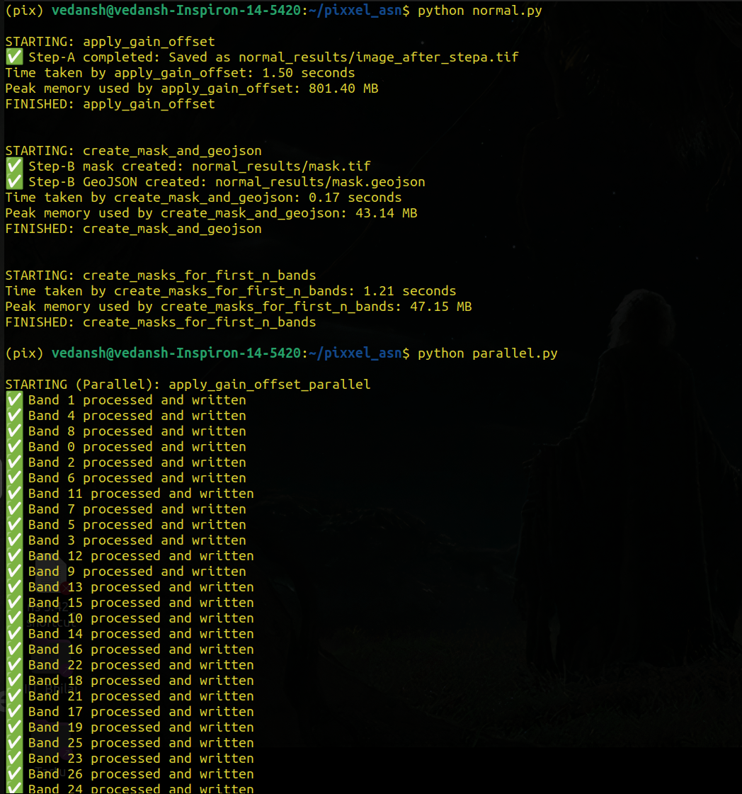
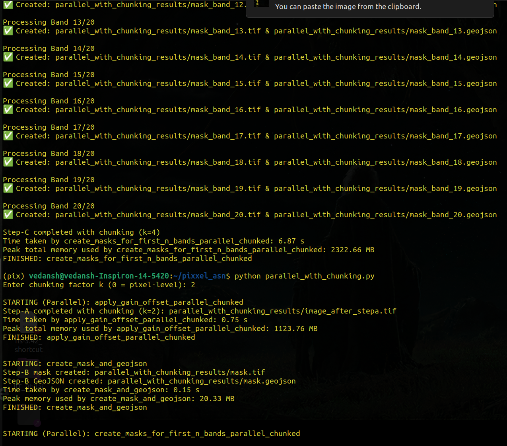

# Hyperspectral Image Processing- Software Engineering Challenge

This project performs specific operations on a **hyperspectral satellite image** (`sample_image.tif`) in a structured, modular, and performance-optimized way.  
The goal is to showcase both **correctness** and **software engineering principles**, including performance benchmarking, modularity, and reproducibility.

---

## Time and Space Complexity

Let:
- **p** = number of CPU cores  
- **r** = number of rows in the image  
- **c** = number of columns in the image  
- **k** = number of chunks  
- **z** = number of bands to be processed  

### Step-B  
Thresholding a single band  
→ **Time = O(r * c)**  
→ **Space = O(r * c)**  

---

### Step-A and Step-C  
Both these steps involve **multi-band operations**, so their performance can be improved through parallelization and chunking.

Three approaches were implemented and compared:

1. **Normal (Sequential)**  
   → Bands processed one after another  
2. **Parallel (Multi-processing)**  
   → Bands processed concurrently using multiple CPU cores  
3. **Parallel + Chunking**  
   → Bands divided into chunks, each processed in parallel, done to reduce load on memory(if needed)

---

## Time and Space complexity for parallel tasks

We have z bands which are divided amongst p processes(cpu cores)  
So each process gets z/p bands, each having r rows and c columns   
The time taken by one process is the same as the time taken by all the processes as they are parallel    
So, the Time Complexity is O(z/p * r * c)


Each process loads r rows and c columns (which make one band) into the memory, when they are processed, then the next band is loaded, so basically each process takes r*c space   
Since there are p processes, the total Space Complexity is O(p * r * c)


## Step-A: Band-wise Gain and Offset (first 65 bands)

z = 65   

| Method | Time Complexity | Space Complexity | Notes |
|---------|----------------|------------------|--------|
| Normal | O(z * r * c) | O(r * c) | Sequential, least memory, slowest |
| Parallel | O((z / p) * r * c) | O(p * r * c) | Utilizes all cores, high memory use |


---

## Step-C: Thresholding (first 20 bands)

z = 20   

| Method | Time Complexity | Space Complexity | Notes |
|---------|----------------|------------------|--------|
| Normal | O(z * r * c) | O(r * c) | Simple, memory efficient |
| Parallel | O((z / p) * r * c) | O(p * r * c) | Faster, higher memory usage |


---


## Chunking
The Time complexity for parallel processing is O(p * r * c)
This may put a significant load on the RAM, 

So in cases like this, one thing which we can do is chunking!

Two approaches to take:

1. We can reduce the number of processes:   
   This will reduce the value of p * r * c, but can increase the time complexity, which is inversely proportional to p

2. We can break each band of the image into some chunks:  
   Suppose we break rows into k parts and columns into k parts too, hence each band gets broken into k<sup>2</sup> chunks


So I divide each band into k^2 chunks (each row into k parts, each column into k parts, hence total k<sup>2</sup>)   
**Space complexity = O(p * (r/k) * (c/k))**
Our space complexity is getting reduced by a factor of k<sup>2</sup>. Yay!   


**Time complexity = (z/p)*(k^2)*(r/k)*(c/k)  = O(z/p * r * k)**
Same as before! (theoretically, if we ignore overhead)

| Method | Time Complexity | Space Complexity | Notes |
|---------|----------------|------------------|--------| 
| Parallel with chunking(k) | O((z / p) * r * c) | O(p * r * c/k<sup>2</sup> ) | Faster, higher memory usage |

Each band a process was getting is now divided into k^2 parts but the time complexity doesnt increase(theoretically, if we ignore overhead) because the row size and the column size of each part also reduced


Advancing this further, why stop at k?
We can break down each image into its pixels and at one time, load only a pixel into memory.     
The space would be O(p) and time would remain the same, that is, O(z/p * r * c)


This makes sense because why load whole band into memory when the calculations we want to do are of pixel level (the calculation of one pixel does not depend on other pixels)


Practically this may take more time(it does!):

The O(z * r * c / p) time complexity only measures computation. It completely ignores the cost of overhead.

In the pixel-level model, the overhead would be astronomical. Think of it like this:

Chunk Model: 
   You tell a worker: "Go to the filing cabinet (disk), get the 'Band 5' folder (read a chunk), stamp every page (process), and put it back." The walk to the cabinet (I/O) is 1 minute, but the stamping (computation) takes 10 minutes. This is efficient.   

Pixel Model: 
   You tell a worker: "Go to the cabinet, get page 1, stamp it, put it back. Now go to the cabinet, get page 2, stamp it, put it back..." The stamping (computation) takes 0.1 seconds, but the walk (I/O + scheduling overhead) takes 1 minute. You spend 99.9% of your time just walking.

Our "overhead" consists of:

1. I/O Overhead: It is infinitely faster to read one 100MB file from disk than it is to read 100 million 1-byte files. Every read operation has a high fixed cost (system calls, disk seek time).

2. Scheduling Overhead: The ProcessPoolExecutor would have to manage z * r * c tasks (billions or trillions). The overhead of the pool just managing this queue would be greater than the computation itself.

3. Function Call Overhead: Every call to processing function has a small, fixed time cost. Doing this billions of times adds up.

Conclusion: 
   Chunking is the balance. The goal is to find the sweet spot in the chunk size:   
   Small enough to fit comfortably in RAM (p * chunk_size < RAM).   
   Large enough that the computation time on that chunk is significantly greater than the overhead time of loading it.


### How to calculate chunk size?
Hit and trial is a practical approach. The "sweet spot" is finding the largest chunk size (smallest k) that fits in the RAM.

Here is how we can do it:

1. Establish a Baseline: Try k=1 (or the original non-chunked parallel code).

2. If it runs without crashing(which it did on my device): 
   This is the sweet spot. k=1 will almost always be the fastest because it has the absolute minimum I/O overhead.

3. If it crashes (Out of Memory): 
   We must chunk. Go to step 2.
   Find the "Working k": Start with k=2.

   Run it. Does it crash?

   If yes, try k=3 or k=4.

   Keep increasing k until you find the first, smallest k that successfully runs without an OutOfMemory error.

   This is the Sweet Spot:

   Let's say k=4 is the first one that works. Then this will be the answer.

   We could try k=5 or k=6 to see if they are faster, but as my results show, they will almost always be slower due to the rapidly increasing overhead.

   Remember, the sweet spot isn't about finding the fastest possible time (which is k=1), but about finding the fastest time you can get within your memory budget.


---

## Directory Structure

The project is organized as follows:      
pixxel_asn   
│   
├── README.md     
├── sample_image.tif    
├── requirements.txt  
├── normal.py  
├── parallel.py  
├── parallel_with_chunking.py  
├── normal_results/   
├── parallel_results/  
├── parallel_with_chunking_results/    
└── images/       
     ├── ss1.png    
     └── ss2.png


Each script performs the same operations but with a different implementation strategy.  
Each results folder stores the output files (`mask.tif`, `mask.geojson`).

---

## How to Run

1. Create and activate a virtual environment
   ```
   python -m venv venv
   source venv/bin/activate   # for Linux/Mac
   venv\Scripts\activate      # for Windows
   ```

2. Install dependencies
   ```
   pip install -r requirements.txt
   ```

3. Run code
   ```
   python normal.py
   python parallel.py
   python parallel_with_chunking.py
   ```
   Enter the value of k for parallel_with_chunking.py, 0 means we want to keep a single pixel as a chunk


## Time and Memory Consumption Results

| Method              | Step   | Time (s) | Peak Memory (MB) | 
| ------------------- | ------ | -------- | ---------------- | 
| Normal              | Step-B | 0.17        | 43.14                
| Normal              | Step-A | 1.50        | 801.40                | 
| Parallel            | Step-A | 0.53        | 1260.16                | 
| Parallel + Chunking(2) | Step-A | 0.75        | 1123.76                | 
| Parallel + Chunking(4) | Step-A | 1.38        | 1074.70             | 
| Parallel + Chunking(8) | Step-A | 3.64        | 1053.89                | 
| Normal              | Step-C | 1.21        | 47.15               |  
| Parallel            | Step-C | 0.49        | 1582.95                |   
| Parallel + Chunking(2) | Step-C | 3.66        | 1352.41                |  
| Parallel + Chunking(4) | Step-C | 6.87        | 2322.66                  |
| Parallel + Chunking(8) | Step-C | 17.48        | 4904.85                |      


## Screenshots
When you run, it should look something like this   





## Software Engineering Highlights

* **Modular Design:** Separate scripts for each implementation for clarity and comparison.
* **Functional Programming:** Core transformations implemented as pure functions.
* **Object-Oriented Structure:** Reusable `ImageProcessor` class handles all operations.
* **Performance Benchmarking:** Decorators used to measure runtime and memory.
* **Reproducibility:**

  * All dependencies pinned in `requirements.txt`
  * Code tested on Python 3.10+
  * Compatible with Linux and Windows

---

## Conclusion

This project demonstrates how **parallelization** and **memory-aware chunking** can significantly optimize hyperspectral image processing tasks — achieving a balance between **speed, correctness, and resource efficiency** while adhering to solid **software engineering practices**.


**Author:** Vedansh Sharma  
**Language:** Python 3.10+    
**Libraries:** `rasterio`, `numpy`, `geopandas`, `concurrent.futures`, `psutils`   
